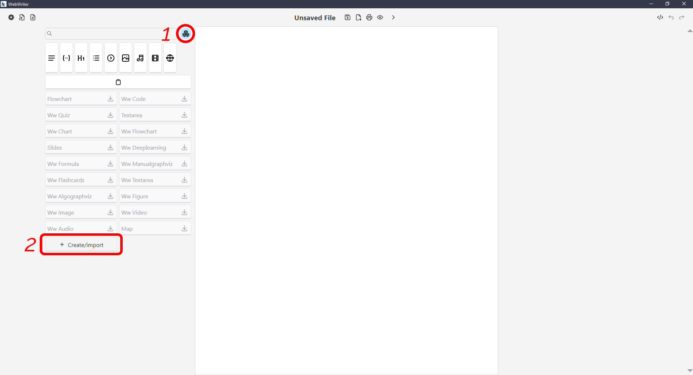
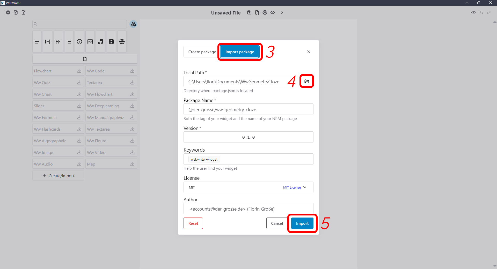

# WebWriter Geometry Cloze Widget

This repo contains a widget written in Lit that implements an editor for geometry cloze style exercises. It is espacially designed to be used in the [WebWriter software](https://webwriter.app/). \
This widget was created as part of the bachelor thesis of [Florin Große](https://der-grosse.de) titled "Implementation of a widget for geometry exercises".

## Installation

You need to have [Node.js](https://nodejs.org/) installed to run the following commands. \
To install all depedencies use the [pnpm package manager](https://pnpm.io/installation).

```bash
pnpm install --frozen-lockfile
```

## Preview / Usage

### Standalone

To preview the widget in a standalone environment run the following command:

```bash
pnpm preview
```

This will start a local server and open the widget in your default browser.

### In WebWriter

To import this local version of the widget into WebWriter, follow the instructions below:





After importing the widget, you should see the widget in the list of available widgets in WebWriter.

**CAUTION:** There is currently a bug in WebWriter that prevents the widget from being imported, when it is not on the same partition as WebWriter.

## Development

The development is easiest done in the context of WebWriter. To start import the widget into WebWriter and click the lightning icon next to the widget. This will enable hot-reloading of the widget in WebWriter.
